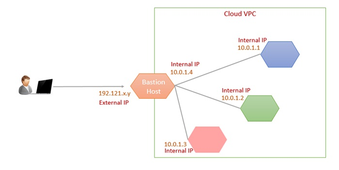

# Bastion Server
- hosted by a special-purpose computer on a network designed and configured to withstand attacks
- computer generally hosts a single application/process e.g. a proxy server or load balancer 
- all other services are removed/limited ro reduce threat
- bastion host server will provide access to a private network from an external network
- e.g. it can be used to mitigate risk of allowing SSH connections from external networks to linux instances launched within a private subnet of a virtual private cloud
