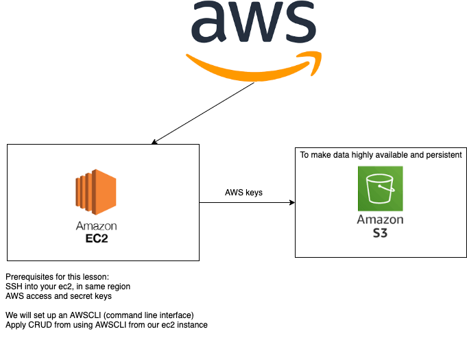

# Disaster Recovery with AWS and s3 Buckets

- any deployed app will be more available by utilising multiple servers in multiple availability zones
- this also acts as a backup if a data centre/server goes down
- load balancing balances load between instances: can balance between apps or networks
- Route 53: DNS server, monitors availability zones and automatically redirects trqffic if a zone goes down, a redirects back when original one goes back online
- an s3 bucket is essentially a cloud folder, globally available

### Setting up AWS CLI (command line interface)
- within an ec2 instance, run the following commands for the necessary installs:
```linux
sudo apt-get install python3.7 
sudo apt-get install python3-pip -y
sudo python3.7 -m pip install awscli (use which ever python version you have installed here, must be 3.6 or above)
aws configure (this step is where AWS access keys are entered and the region is chosen - use same region as instance, eu-west-1 in this case)
```
- if the python install does not work try the steps detailed in https://websiteforstudents.com/installing-the-latest-python-3-7-on-ubuntu-16-04-18-04/

### S3 Buckets and Commands
- the following commands can be used inside the connected ec2 instance:
- `aws s3 ls` will show a list of buckets
- `aws s3 mb s3://<bucketname>` will create a bucket - pay attention to naming rules; no special characters
- with any files in the ec2 instance, use `aws s3 cp <filename> s3://<bucketname>` to copy to the bucket

**NOTE** filepaths within the bucket can contain folders

- to download files from the bucket use `aws s3 cp s3://<bucketname>/<filename> <filename>`, where the second `filename` is the filename on the local host to be saved
- `aws s3 rm s3://<bucketname>/<filename>` deletes objects
- `aws s3 rb s3://<bucketname>` deletes buckets, but must be empty