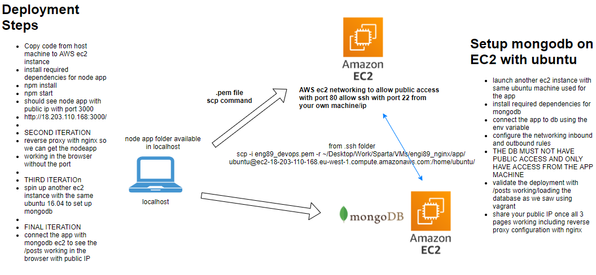
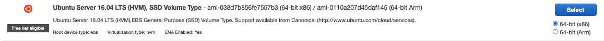
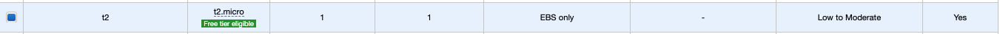
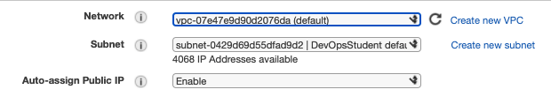
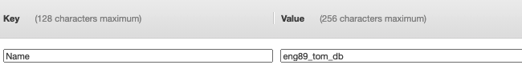
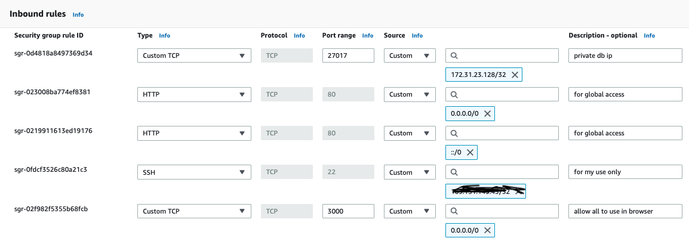
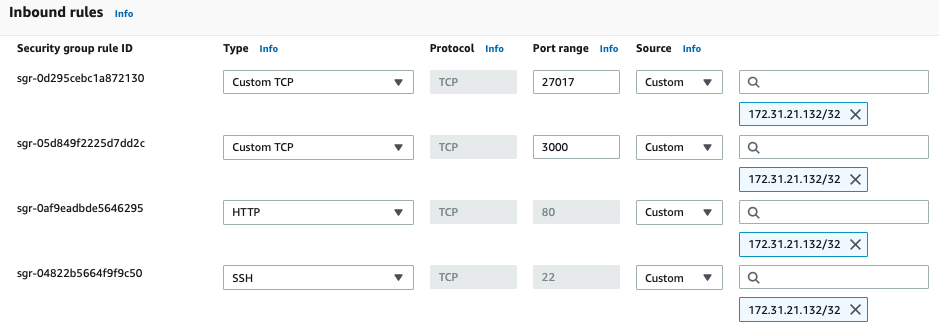

# Cloud Computing with AWS
## 2-tier App Deployment
- use one instance for the node app and one for the mongodb

- db instance only accessed by app instance

### before running
- .pem key must be downloaded into .ssh folder
- in this folder run the following command the first time `chmod 400 eng89_devops.pem`
- to SSH into either instance, Paste SSH client command from AWS - `ssh -i "eng89_devops.pem" ubuntu@ec2-34-245-102-20.eu-west-1.compute.amazonaws.com` - this is for app instance. Must be done in .ssh folder (or wherever .pem key is stored)
- NOTE: the securoty groups can only be finished when both instances are setup, see Updating Security Rules below
- once all the below installation is done, SSH into the app instance, `cd app` and `npm start`

### node app setup
- set up AWS ec2 instance
- choose correct AMI (Amazon Machine Image)

- choose correct Instance Type (free tiers available)

- configure instance details - any not shown below are left as default

- leave storage as it is
- name it in tags, note that the below image is the databse instance, the app would be the same but _app

- security group - ips added to allow explicit access

- scp command to copy app folder form vagrant setup - done from .ssh folder once instance is setup
`
scp -i eng89_devops.pem -r /Users/Tom1/Documents/Sparta/Vagrant/Dev_Env/eng89_dev_env/app ubuntu@34.245.102.20:~/app/
`
- SSH into instance (see above)
- install dependencies with the following commands:
`
sudo apt-get update -y
sudo apt-get upgrade -y
sudo apt-get install nginx -y
curl -sL https://deb.nodesource.com/setup_6.x | sudo -E bash - 
sudo apt-get install -y nodejs 
npm install pm2 -g 
sudo apt-get install python-software-properties -y # installs any missing python properties
sudo rm -rf /etc/nginx/sites-available/default # reverse proxy setup so port 3000 isnt needed
sudo echo "server{
        listen 80;
        server_name _;
        location / {
        proxy_pass http://34.245.102.20:3000;
        proxy_http_version 1.1;
        proxy_set_header Upgrade \$http_upgrade;
        proxy_set_header Connection 'upgrade';
        proxy_set_header Host \$host;
        proxy_cache_bypass \$http_upgrade;
        }
}" >> /etc/nginx/sites-available/default
# Restarts nginx
sudo systemctl restart nginx
sudo systemctl enable nginx
`
- db env variable once db instance is setup, using private db ip here
add `DB_HOST=mongodb://172.31.23.128:27017/posts` to `~/.bashrc` file using `sudo nano` command

### db setup
- same setup but different security group so only app can access by using app ip address

- install mongo in the db instance with followng commands: - look at db provision.sh
`
sudo apt-get install gnupg
sudo apt-key adv --keyserver hkp://keyserver.ubuntu.com:80 --recv D68FA50FEA312927
echo "deb https://repo.mongodb.org/apt/ubuntu xenial/mongodb-org/3.2 multiverse" | sudo tee /etc/apt/sources.list.d/mongodb-org-3.2.list
sudo apt-get update -y
sudo apt-get upgrade -y
sudo apt-get install -y mongodb-org=3.2.20 mongodb-org-server=3.2.20 mongodb-org-shell=3.2.20 mongodb-org-mongos=3.2.20 mongodb-org-tools=3.2.20 --allow-unauthenticated
curl -sL https://deb.nodesource.com/setup_6.x | sudo -E bash - 
sudo apt-get install -y nodejs
npm install pm2 -g 
sudo apt-get install python-software-properties -y
`
- navigate to `/etc` and `sudo nano mongod.conf` and change the bindIp to 0.0.0.0

### Updating Security Rules
- when viewing an ec2 instance, navigate to the security tab and select the security group
- in the onbound rules section there is an edit button which is used to add/change/delete rules

